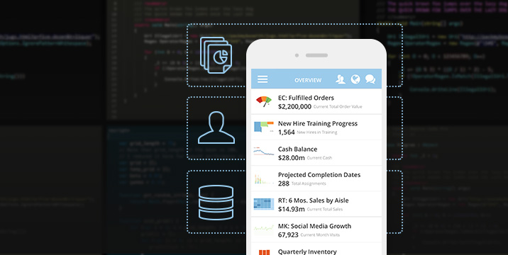

# Getting Started



Domo boasts many ways to import and export your data. There are hundreds of data [Connectors](https://www.domo.com/connectors#/), as well as Custom Connectors, the Workbench tool, and Custom Workbench Plug-ins. Even further, you can fully automate your Domo Warehouse via the Domo Software Development Kit (SDK) and the Domo API.

The Domo SDK is the simplest way to automate your Domo instance. The SDK streamlines the API programming experience, allowing you to significantly reduce your written code. If the SDK does not meet your needs, you may write code directly against the API.

The Domo SDK/API currently allows you to automate DataSets, Streams, Users, and Groups. The following examples illustrate direct HTTP communication with the API. If you want to utilize the API and write less code, use the SDK.

# Introduction

Welcome to the Domo Public API! You can use our API to access Kittn API endpoints, which can get information on various cats, kittens, and breeds in our database.

We have language bindings in Shell, Ruby, and Python! You can view code examples in the dark area to the right, and you can switch the programming language of the examples with the tabs in the top right.

This example API documentation page was created with [Slate](https://github.com/tripit/slate). Feel free to edit it and use it as a base for your own API's documentation.

# Authentication

> To authorize, use this code:

```ruby
require 'kittn'

api = Kittn::APIClient.authorize!('meowmeowmeow')
```

```python
import kittn

api = kittn.authorize('meowmeowmeow')
```

```shell
# With shell, you can just pass the correct header with each request
curl "api_endpoint_here"
  -H "Authorization: meowmeowmeow"
```

```javascript
const kittn = require('kittn');

let api = kittn.authorize('meowmeowmeow');
```

> Make sure to replace `meowmeowmeow` with your API key.

Kittn uses API keys to allow access to the API. You can register a new Kittn API key at our [developer portal](http://example.com/developers).

Kittn expects for the API key to be included in all API requests to the server in a header that looks like the following:

`Authorization: meowmeowmeow`

<aside class="notice">
You must replace <code>meowmeowmeow</code> with your personal API key.
</aside>

# Kittens

## Get All Kittens

```ruby
require 'kittn'

api = Kittn::APIClient.authorize!('meowmeowmeow')
api.kittens.get
```

```python
import kittn

api = kittn.authorize('meowmeowmeow')
api.kittens.get()
```

```shell
curl "http://example.com/api/kittens"
  -H "Authorization: meowmeowmeow"
```

```javascript
const kittn = require('kittn');

let api = kittn.authorize('meowmeowmeow');
let kittens = api.kittens.get();
```

> The above command returns JSON structured like this:

```json
[
  {
    "id": 1,
    "name": "Fluffums",
    "breed": "calico",
    "fluffiness": 6,
    "cuteness": 7
  },
  {
    "id": 2,
    "name": "Max",
    "breed": "unknown",
    "fluffiness": 5,
    "cuteness": 10
  }
]
```

This endpoint retrieves all kittens.

### HTTP Request

`GET http://example.com/api/kittens`

### Query Parameters

Parameter | Default | Description
--------- | ------- | -----------
include_cats | false | If set to true, the result will also include cats.
available | true | If set to false, the result will include kittens that have already been adopted.

<aside class="success">
Remember — a happy kitten is an authenticated kitten!
</aside>

## Get a Specific Kitten

```ruby
require 'kittn'

api = Kittn::APIClient.authorize!('meowmeowmeow')
api.kittens.get(2)
```

```python
import kittn

api = kittn.authorize('meowmeowmeow')
api.kittens.get(2)
```

```shell
curl "http://example.com/api/kittens/2"
  -H "Authorization: meowmeowmeow"
```

```javascript
const kittn = require('kittn');

let api = kittn.authorize('meowmeowmeow');
let max = api.kittens.get(2);
```

> The above command returns JSON structured like this:

```json
{
  "id": 2,
  "name": "Max",
  "breed": "unknown",
  "fluffiness": 5,
  "cuteness": 10
}
```

This endpoint retrieves a specific kitten.

<aside class="warning">Inside HTML code blocks like this one, you can't use Markdown, so use <code>&lt;code&gt;</code> blocks to denote code.</aside>

### HTTP Request

`GET http://example.com/kittens/<ID>`

### URL Parameters

Parameter | Description
--------- | -----------
ID | The ID of the kitten to retrieve
